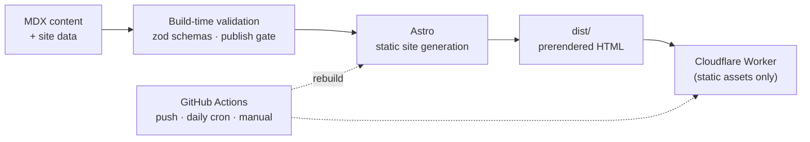

# launch-start

A build-in-public journal: side projects taken from zero to shipped in timed
public sprints, with weekly build logs and a permanent archive of what shipped.

**[willzhu.dev →](https://willzhu.dev)**

Built with Astro + MDX and prerendered to static HTML, then deployed as a
Cloudflare Worker with static assets only — no application server or backend.
Hosting and bandwidth are free at this scale; the domain is the only recurring
cost.

## How it works

The site has no backend and no database. Every page is prerendered at build
time, so the site is a pure function of the repo: content is a folder of MDX
files, validated against a schema at build, rendered to static HTML, and served
from the edge.

Two ideas do most of the work:

- **Scheduled publishing with no server.** A post carries a `date`, and a single
  publish gate hides anything future-dated. A daily GitHub Actions cron rebuilds
  the site, so a scheduled post goes live on its own the morning its date
  arrives — no push, no cron job running on a box somewhere.
- **A live sprint counter that stays honest.** Sprint day numbers ("day 6 of
  14") are computed at build from pure date math. That same daily rebuild keeps
  the counter current without anyone touching it.



## Run locally

```sh
pnpm install
pnpm dev       # localhost:4321 — drafts and future-dated posts visible
pnpm build     # production build: drafts excluded, content validated
pnpm test      # unit tests
pnpm check     # astro check + biome
pnpm test:dist # built-site smoke tests; run after pnpm build
```

The stack: Astro 7, MDX content collections, TypeScript, pnpm, Biome, Vitest,
and Cloudflare Workers static assets (wrangler).

## Deployment

`wrangler.jsonc` is the source of truth for the `launch-start` Worker, its
static assets, and the `willzhu.dev` custom domain. A first deployment from a
local machine is:

```sh
pnpm install
pnpm run deploy:dry-run
pnpm run cf:login
pnpm run deploy
```

The custom domain requires `willzhu.dev` to be an active zone in the same
Cloudflare account, with no conflicting CNAME on the apex hostname. Cloudflare
creates the Worker DNS record and certificate during deployment.

After the first deploy, `.github/workflows/deploy.yml` handles releases on every
push to `main`, on manual dispatch, and once daily so scheduled posts and sprint
counters stay current. The repository needs these GitHub Actions settings:

- Secrets: `CLOUDFLARE_API_TOKEN`, `CLOUDFLARE_ACCOUNT_ID`
- Variables: `PUBLIC_CONTACT_EMAIL` if the public contact link should render;
  `SITE_ORIGIN` only when overriding the `https://willzhu.dev` default

Create the API token from Cloudflare's **Edit Cloudflare Workers** template and
restrict it to this account and the `willzhu.dev` zone. The deployment needs
Workers Scripts Write and Workers Routes Write access. No Cloudflare credential
belongs in `.env` or the repository.

## License

The source code — components, TypeScript, styles, build tooling, and
configuration — is [MIT](LICENSE), free to reuse. The site's content is not:
the writing under `src/content/` and the images under `src/assets/` and
`public/` are © 2026 William Zhu, all rights reserved.
